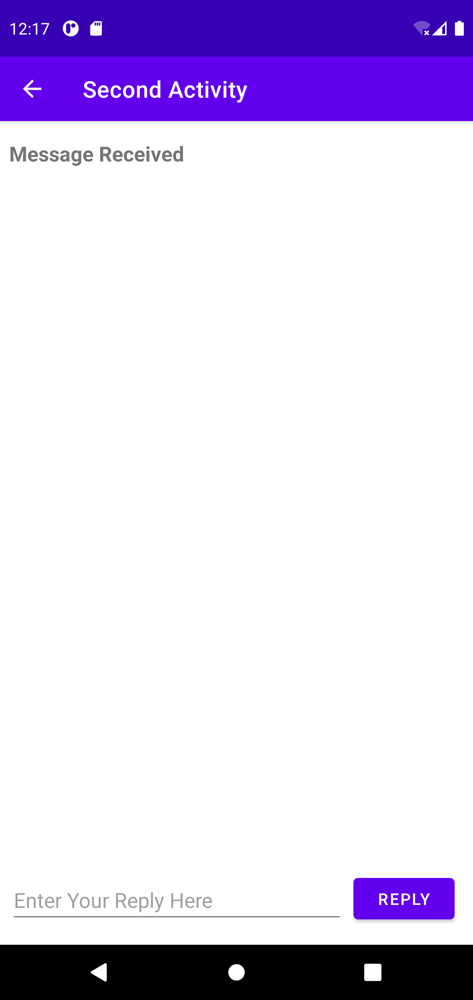
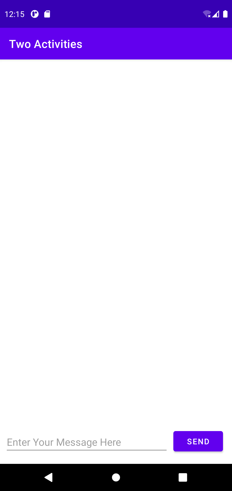
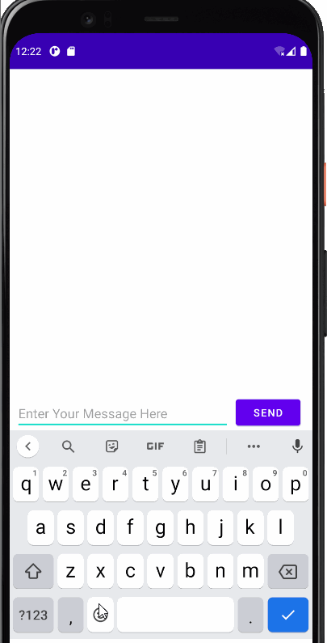
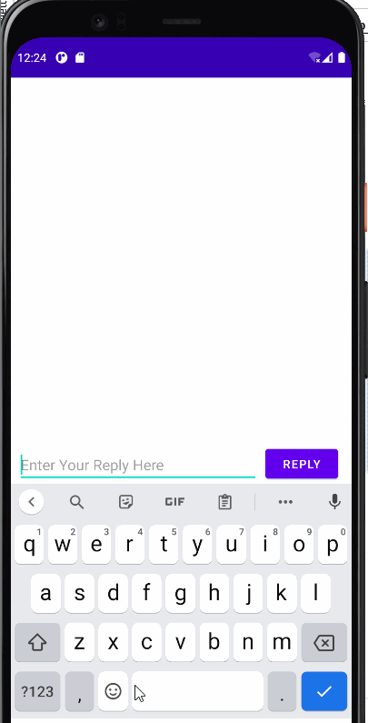
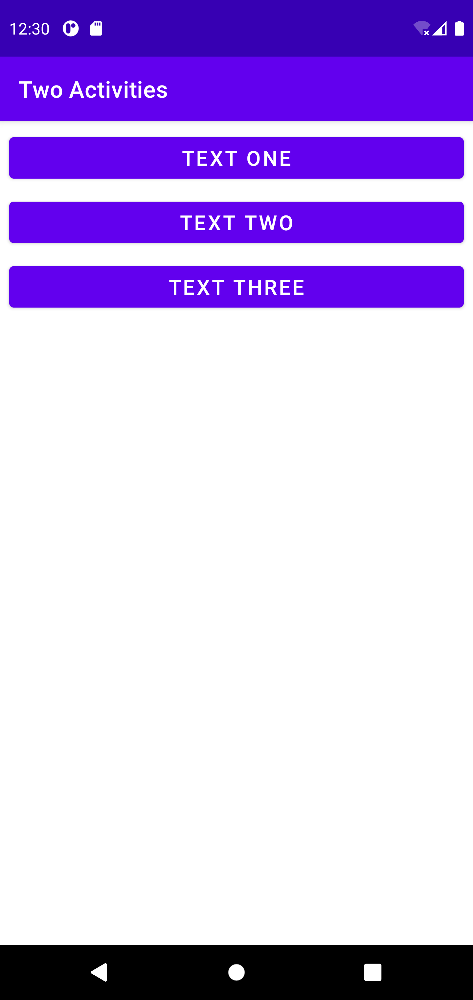
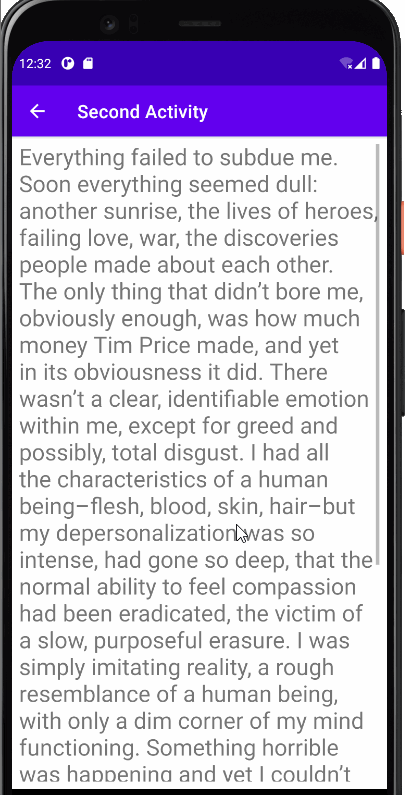
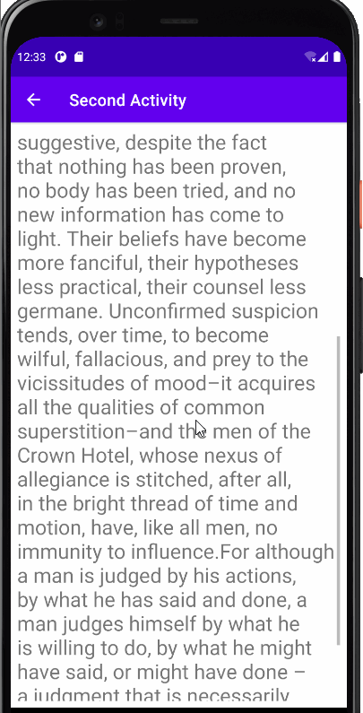
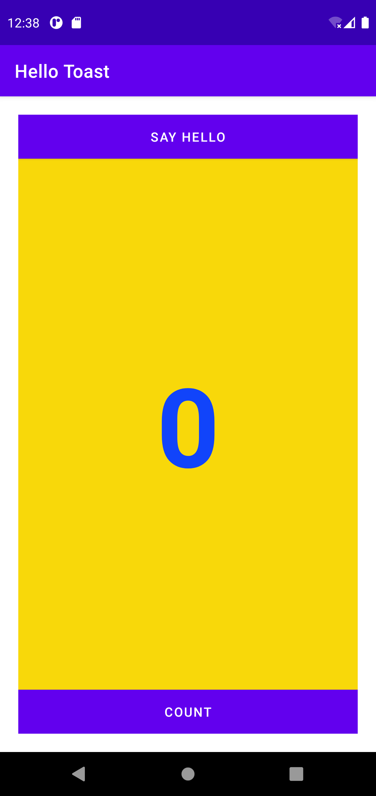
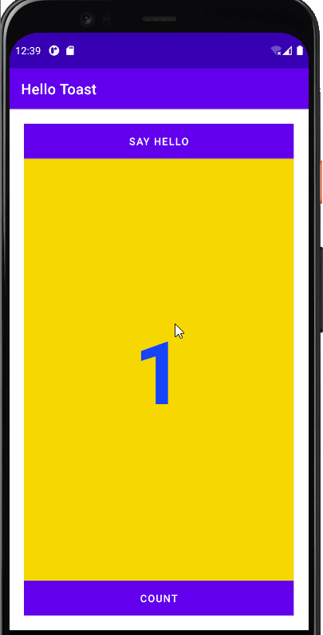

# Lab-4-TwoActivities

## Two Activities Overview

- Application MainActivity Index

- Application SecondActivity Index

## Two Activities Application Workings

  - Sending Message

  - Replying Message

# Two Activities Challenge

## Two Activities Challenge Overview

- Application Index

## Hello Toast Challenge Application Workings

- Text One Button

- Text Two Button

- Text Three Button

# Hello Toast Homework

## Hello Toast Homework Overview

- Application MainActivity Index

## Hello Toast Homework Application Workings

- Count Button

